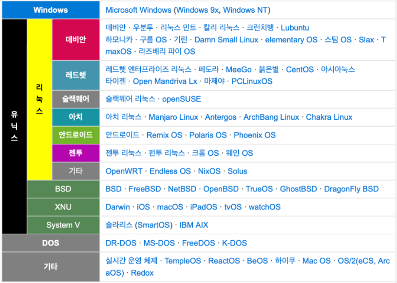
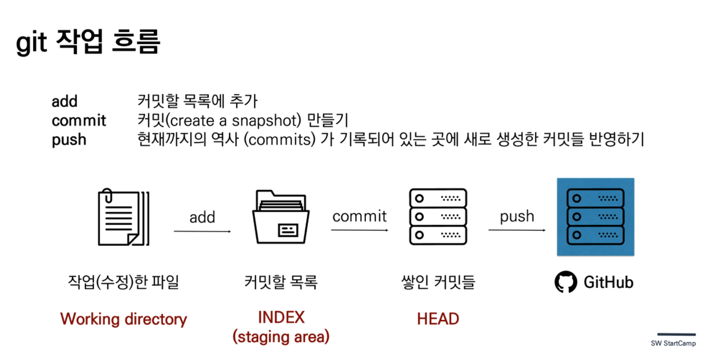

## 210715 Python 필기

### 깃 & gitHub

프로그래머의 기본 소양 중 하나! 꼭 배워야 한다.

terminal에서 깃 :

현존하는 운영체제는 유닉스 / 윈도우즈 뿐

#### 깃 작업 흐름 

`working directory -> INDEX(staging area) -> Commit`

init -> add -> commit -> push

add: 커밋할 목록에 추가 (commits == 버전) 

​       => INDEX (staging area) 즉 커밋 대기 정도 느낌

commit: 커밋 만들기 (create a snapshot)

push: 현재까지의 역사가 기록되어있는곳에 새로 생성한 커밋 push (스택인듯) GitHub에 push 됨

여기서 커밋은 `추가 변경사항`에 대한 내용이 저장되는 구조

ex) def a:  -> commit 1

​      이후 해당문서에

​      def b : 를 추가한뒤 커밋을 새로 만들면

​     추가된 커밋에는 def b:가  기록되는것!

#### git bash 단축키

*CLI (Command Line Interface) : 커맨드라인 인터페이스 이용*

*GUI(Graphic User Interface) : 그래픽 이용 (우리가 익숙한게 GUI)*

CLI 사용시 주의사항

1. 반드시 내가 어디에 있는지 생각해야한다 (파일 경로)

기본적인 CLI 명령어들

git --help : 필요한 명령어들 다 볼 수 있음!

cd 디렉토리파일명/ : 해당 디렉터리로 이동 (change directory)

cd .. : 상위 디렉터리로 이동

ls : 해당 디렉토리에 존재하는 파일들 리스트 보여줌

*파일명, 디렉토리명 한글도 가능!*

touch 파일명 : 해당 파일명의 파일 생성

mkdir 디렉토리명 : 해당 명칭의 디렉토리 생성 

ctrl + l :  커맨드라인 화면 clear

pwd : 현재 내가 있는 위치(경로) 반환

~ : Home 디렉토리로 이동 

커맨드 뒤에 `- + 옵션`으로 추가 기능 부여 가능

git init: 해당 경로의 디렉토리를 git으로 관리하겠다는 명령어

 			(로컬 저장소가 되는 것, 관리 범위 설정 用)

​             따라서 설정한 범위 하위 레벨에서 추가 git init 설정은 불가!

git status : git의 현재 상태 반환***가장 중요함**

​                   (현재 파일들의 위치 / 커밋 여부를 반환해주는 것)

git add 파일명 :  INDEX(staging area)에 포함시켜주는 명령어 

git add . : 현재 디렉토리에 모든 파일을 add 해줌

git commit -m "커밋메시지" : 커밋 생성 명령어 

​                           =>  "  " 요 안에 쓰는 커밋메시지로 커밋 ver 구분 

git config --global : 전역 정보 수정

=> user.name / user.email  최초 1회 설정해주어야함 

git log : 커밋 이력 확인
